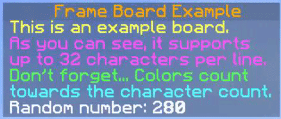

# Frame
A Spigot/Bukkit API library to create and update scoreboards.

### Features
* Non-flickering.
* Supports up to 32 characters per line.
* Extremely light weight.
* Developer friendly. Setup your board in a few lines.

### Example
```
@Override
public void onEnable() {
	new Frame(new ExampleFrameAdapter());
}
```
```
public class ExampleFrameAdapter implements FrameAdapter {

	@Override
	public String getTitle(Player player) {
		return ChatColor.GOLD.toString() + "Frame Board Example";
	}

	@Override
	public List<String> getLines(Player player) {
		final int rand = ThreadLocalRandom.current().nextInt(500);
		final List<String> toReturn = new ArrayList<>();

		toReturn.add("&eThis is an example board.");
		toReturn.add("&dAs you can see, it supports");
		toReturn.add("&dup to 32 characters per line.");
		toReturn.add("&aDon't forget... Colors count");
		toReturn.add("&btowards the character count.");
		toReturn.add("Random number: " + rand);

		return toReturn;
	}

}

```


### Note
* It might have a similar structure to other Scoreboard APIs/libraries but the actual teams / updating scores technique is different. This is probably the most simple and performance efficient Scoreboard library.
